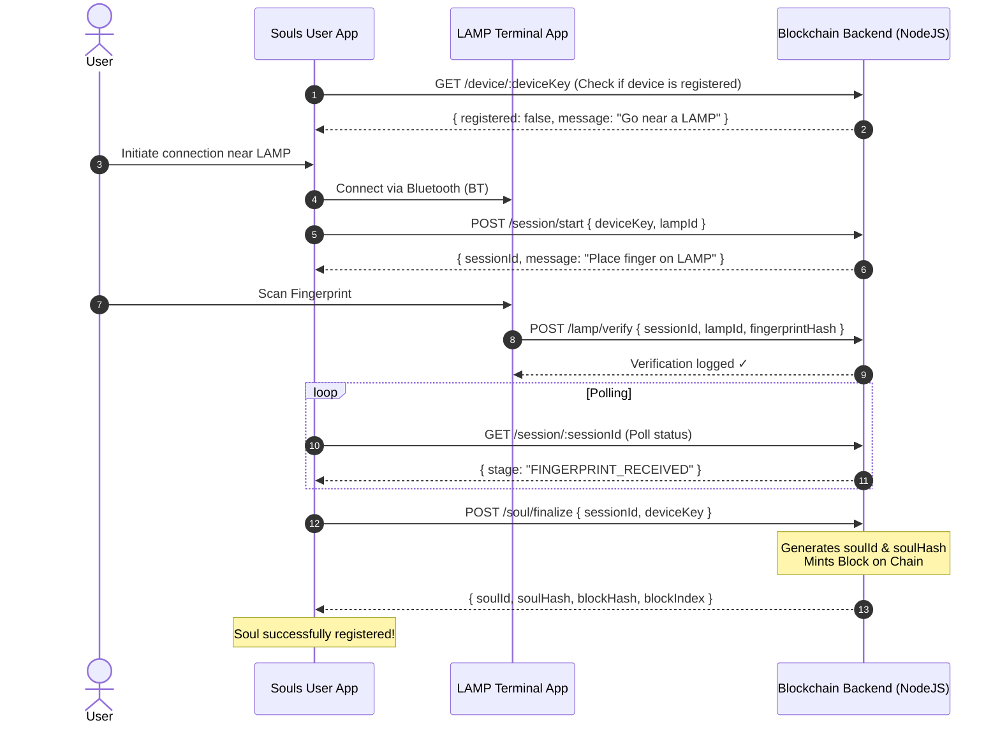

# Souls: Biometric-Backed Decentralized Identity & Security Suite

Souls is an end-to-end decentralized identity management system and security suite. It consists of an Android client application (**Souls**), a dedicated biometric verification terminal app (**LAMP**), and a lightweight Node.js-based blockchain backend (**SoulsChain**). 

The suite enables users to mint a non-transferable, biometrically-secured digital identity ("Soul") by pairing their mobile device with a physical terminal via Bluetooth, which is then registered on a secure, cryptographic ledger. In addition to identity management, the client app features a custom local VPN-based App Firewall, background security vulnerability scanners, and robust Parental Controls (bedtime schedules, app limits, and screen blocking).

---

## 🎨 System Architecture & Workflow

The identity registration process follows a secure, 5-step handshaking flow between the User App, the physical LAMP Terminal, and the Blockchain Backend:



---

## 📁 Repository Structure

The project is organized into three major subdirectories:

```text
Souls/
├── backend/
│   └── Aarohan-26-CSI-RAIT-Angry-Birds/
│       ├── blockchain.js         # Core in-memory SHA-256 blockchain logic
│       ├── server.js             # Express API Server and route management
│       ├── package.json          # Node.js configurations and dependencies
│       └── package-lock.json
├── frontend/
│   └── Aarohan-26-CSI-RAIT-Angry-Birds/
│       ├── app/
│       │   ├── build.gradle      # Android app module configuration
│       │   └── src/main/
│       │       ├── AndroidManifest.xml # Permissions, receivers, and services
│       │       ├── java/com/example/souls/
│       │       │   ├── activities/     # Splash, Main, Onboarding, Registration screens
│       │       │   ├── adapters/       # UI adapters
│       │       │   ├── models/         # Data representation structures
│       │       │   ├── network/        # SoulsApi client, ApiManager
│       │       │   ├── parental/       # Usage statistics, bedtime rules, lock service
│       │       │   └── vpn/            # Local VPN firewall & boot receivers
│       │       └── res/                # UI resources, layouts, strings, and assets
│       ├── build.gradle          # Root gradle config
│       └── settings.gradle       # Defines root project name ("Souls")
└── lamp/
    └── Aarohan-26-CSI-RAIT-Angry-Birds/
        ├── app/
        │   ├── build.gradle      # Android lamp module configuration
        │   └── src/main/
        │       ├── AndroidManifest.xml # Permissions for biometrics & camera
        │       ├── java/com/example/lamp/
        │       │   └── activities/     # Standby, Scan, and Result screens
        │       └── res/                # Layouts and assets for the simulator
        ├── build.gradle          # Root gradle config
        └── settings.gradle       # Defines root project name ("lamp")
```

---

## 🚀 Component Breakdown

### 1. Blockchain Backend (`/backend`)
A lightweight, secure Node.js engine running an Express API Server. It manages:
- **Custom Blockchain (`blockchain.js`)**: Handles cryptographic hashing (SHA-256), genesis block creation, difficulty levels (Proof of Work mining), block validation, and mapping verified biometric hashes to device keys.
- **Session Management**: Uses time-to-live (TTL) logic to manage sessions during Bluetooth pairing.
- **Integrity Validation**: Exposes endpoints to run structural checks and verify the blockchain is untampered.

### 2. Souls User App (`/frontend`)
The main client Android application acting as the digital identity wallet and device protection hub.
- **Identity Wallet**: Interacts with the backend to query, register, and display the user's Soul ID and cryptographic ledger hash.
- **App Firewall VPN (`vpn/`)**: Implements an `AppFirewallVpnService` that routes and drops traffic for specific malicious or unofficial modified apps (e.g. `com.gbwhatsapp`, `com.instamod`, etc.), causing connections to fail.
- **Parental Controls (`parental/`)**: Monitors active foreground applications in real time using `UsageStatsManager`. If a locked application is opened or if a scheduled bedtime is active, the app displays a full-screen `ParentalBlockedActivity` overlay to lock the screen. It tracks metrics in local databases using Android Room.
- **Background Vulnerability Monitor**: Uses `WorkManager` to run recurring background tasks, scanning the device for security risks (e.g., apps installed from unknown sources).

### 3. LAMP Terminal Simulator (`/lamp`)
An Android application acting as the simulated physical kiosk or terminal.
- **Biometric Integration**: Uses the device's native fingerprint/face scanning hardware via `androidx.biometric` to simulate fingerprint scanning.
- **Verification Delivery**: Submits the generated fingerprint hash directly to the blockchain backend (`/lamp/verify`) to authenticate the active session initiated by the user app.

---

## 🛠️ Installation & Setup

### Prerequisites
- **Node.js**: Version 18 or newer.
- **Android SDK**: API level 34 compatibility.
- **IDE**: Android Studio (Ladybug or higher recommended) with JDK 17.

### Running the Backend Server
1. Navigate to the backend project directory:
   ```bash
   cd backend/Aarohan-26-CSI-RAIT-Angry-Birds
   ```
2. Install dependencies:
   ```bash
   npm install
   ```
3. Start the development server (runs with hot-reloading):
   ```bash
   npm run dev
   ```
   The backend API will be available at `http://localhost:3000`.

### Building the Souls User App (Frontend)
1. Open the `/frontend/Aarohan-26-CSI-RAIT-Angry-Birds` project in Android Studio.
2. If testing on a **physical device** (instead of an emulator), update the `BASE_URL` in [SoulsApi.java](file:///c:/Users/ram/Documents/Projects/Souls/frontend/Aarohan-26-CSI-RAIT-Angry-Birds/app/src/main/java/com/example/souls/network/SoulsApi.java) from `http://localhost:3000` to your computer's local IP address (e.g. `http://192.168.1.100:3000`).
3. Sync Gradle and build the APK.
4. Run the app on your test device. Ensure you grant **Usage Access** permissions for parental controls and **VPN connection approval** for the app firewall.

### Building the LAMP App (Biometric Terminal)
1. Open the `/lamp/Aarohan-26-CSI-RAIT-Angry-Birds` project in Android Studio.
2. Similar to the user app, update any backend endpoints to point to the correct server IP.
3. Sync Gradle, build, and run the app. It will stand by, waiting to scan QR codes or accept fingerprint verification.

---

## 🔌 API Documentation

| Route | Method | Description | Role |
|---|---|---|---|
| `/device/:deviceKey` | **GET** | Check if a device is registered. | User App |
| `/session/start` | **POST** | Start a registration session linking a device and a terminal. | User App |
| `/session/:sessionId` | **GET** | Poll session status to check if verification is complete. | User App |
| `/soul/finalize` | **POST** | Mint a new Soul block on the blockchain. | User App |
| `/soul/:soulId` | **GET** | Retrieve a block by Soul ID. | User App |
| `/soul/by-device/:deviceKey`| **GET** | Look up Soul records by hardware device key. | User App |
| `/lamp/verify` | **POST** | Push biometric fingerprint result to authorize registration. | LAMP Terminal |
| `/chain` | **GET** | Returns the entire block history and checks node validity. | Admin/Debug |
| `/validate` | **GET** | Forces integrity verification across all block hashes. | Admin/Debug |

---

## 🔒 Security Implementations

#### App Firewall VPN Loop
The firewall uses a highly-efficient routing technique. Instead of routing all device traffic and running packet inspection, `AppFirewallVpnService` registers a VPN routing rule specifically for **untrusted/modded application packages** (such as `com.gbwhatsapp` and `org.telegram.plus`).
```java
for (String pkg : BLOCKED_PACKAGES) {
    builder.addAllowedApplication(pkg);
}
```
All packets from these targeted applications flow into the local tunnel. The packet reader thread reads these bytes and discards them (`Drop-on-Arrival`), causing connection timeouts for modded versions of apps while letting official communication apps bypass the VPN with full network speeds.

#### Parental Monitoring
`ParentalLockService` runs a low-priority foreground thread which polls foreground tasks. It bypasses deprecated API limits by querying `UsageStatsManager` with a 3-second window:
```java
List<UsageStats> stats = usm.queryUsageStats(UsageStatsManager.INTERVAL_DAILY, now - 3000, now);
```
If the package name in focus belongs to a blocked application, `ParentalBlockedActivity` is immediately launched with flags `FLAG_ACTIVITY_NEW_TASK | FLAG_ACTIVITY_CLEAR_TOP` to cover the screen and restrict access.
